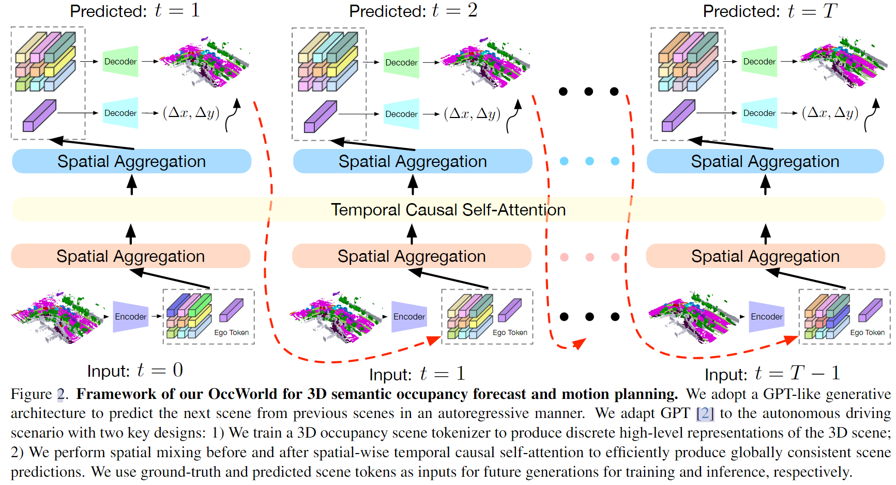
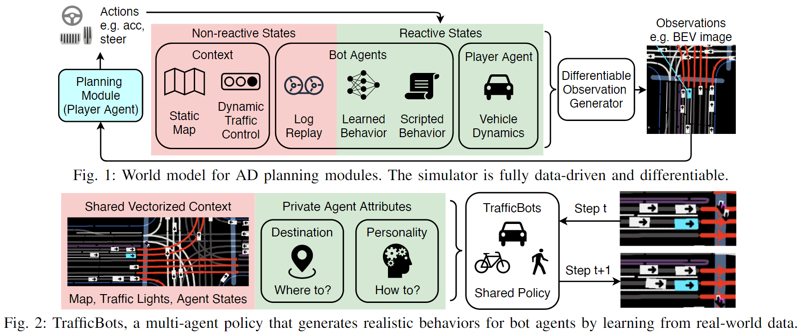
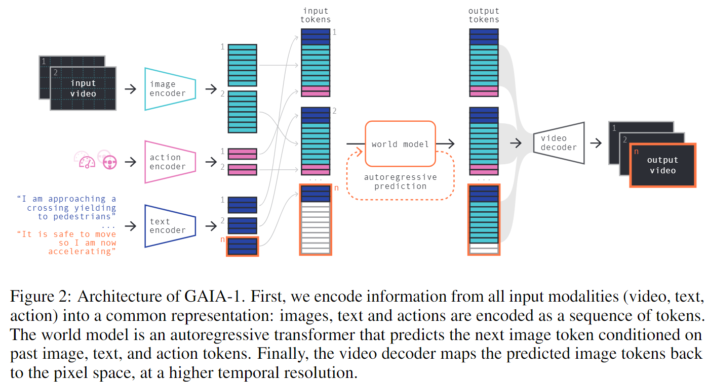
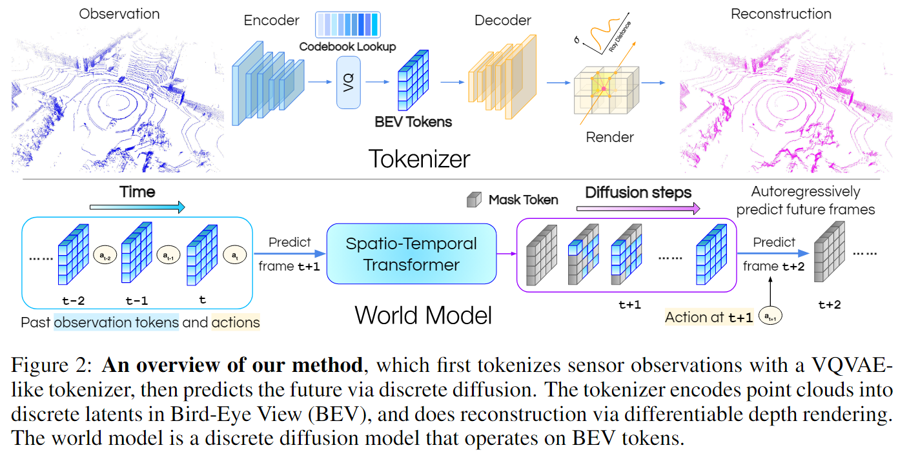
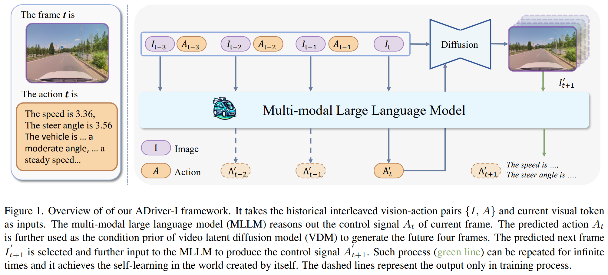
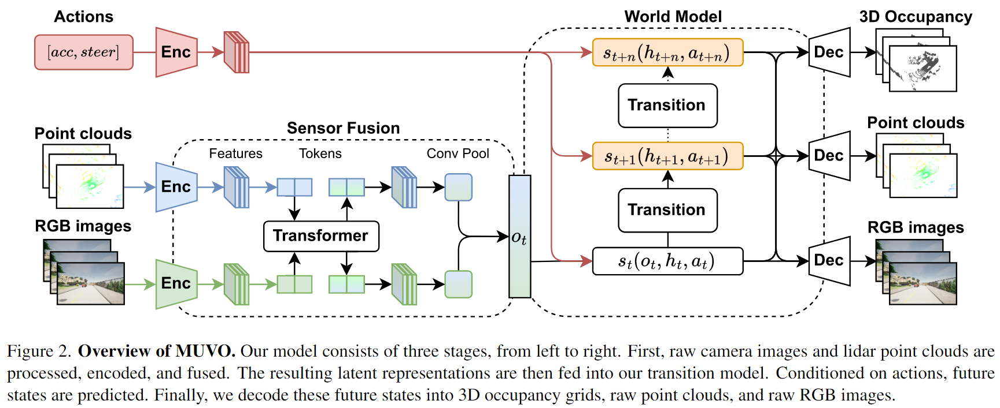

# Awesome-World-Models-for-AD :red_car:

A curated list of awesome world models for autonomous driving (continually updated).

**NOTE**: Here we have contained the abstract and a main figure from the original paper presenting the main framework or motivations to help us take a glance about these papers (You can expand the **Abstract** button to see them).

⭐ Welcome to star and contribute to (PR) this awesome world models for AD! ⭐

## News 📰
- **[2023/12/28]** Initial commit.

## Table of Contents
- [Basics and Backgrounds](#basics-and-backgrounds)
- [World Models for AD](#world-models-for-ad)

## Basics and Backgrounds
TODO.

👆 [Back to Top](#Table-of-Content)
## World Models for AD
**2023**

- **OccWorld: Learning a 3D Occupancy World Model for Autonomous Driving**. [📄 Paper](https://arxiv.org/abs/2311.16038) | [💻 Code](https://github.com/wzzheng/OccWorld)
    

    
Abstract

    Understanding how the 3D scene evolves is vital for making decisions in autonomous driving. Most existing methods achieve this by predicting the movements of object boxes, which cannot capture more fine-grained scene information. In this paper, we explore a new framework of learning a world model, OccWorld, in the 3D Occupancy space to simultaneously predict the movement of the ego car and the evolution of the surrounding scenes. We propose to learn a world model based on 3D occupancy rather than 3D bounding boxes and segmentation maps for three reasons: 1) expressiveness. 3D occupancy can describe the more fine-grained 3D structure of the scene; 2) efficiency. 3D occupancy is more economical to obtain (e.g., from sparse LiDAR points). 3) versatility. 3D occupancy can adapt to both vision and LiDAR. To facilitate the modeling of the world evolution, we learn a reconstruction-based scene tokenizer on the 3D occupancy to obtain discrete scene tokens to describe the surrounding scenes. We then adopt a GPT-like spatial-temporal generative transformer to generate subsequent scene and ego tokens to decode the future occupancy and ego trajectory. Extensive experiments on the widely used nuScenes benchmark demonstrate the ability of OccWorld to effectively model the evolution of the driving scenes. OccWorld also produces competitive planning results without using instance and map supervision.

    

    

- **TrafficBots: Towards World Models for Autonomous Driving Simulation and Motion Prediction**. [📄 Paper](https://arxiv.org/abs/2303.04116) | [💻 Code](https://github.com/zhejz/TrafficBots)
    

    
Abstract

    Data-driven simulation has become a favorable way to train and test autonomous driving algorithms. The idea of replacing the actual environment with a learned simulator has also been explored in model-based reinforcement learning in the context of world models. In this work, we show data-driven traffic simulation can be formulated as a world model. We present TrafficBots, a multi-agent policy built upon motion prediction and end-to-end driving, and based on TrafficBots we obtain a world model tailored for the planning module of autonomous vehicles. Existing data-driven traffic simulators are lacking configurability and scalability. To generate configurable behaviors, for each agent we introduce a destination as navigational information, and a time-invariant latent personality that specifies the behavioral style. To improve the scalability, we present a new scheme of positional encoding for angles, allowing all agents to share the same vectorized context and the use of an architecture based on dot-product attention. As a result, we can simulate all traffic participants seen in dense urban scenarios. Experiments on the Waymo open motion dataset show TrafficBots can simulate realistic multi-agent behaviors and achieve good performance on the motion prediction task.

    

    

- **GAIA-1: A Generative World Model for Autonomous Driving**. [📄 Paper](https://arxiv.org/abs/2309.17080)
    

    
Abstract

    Autonomous driving promises transformative improvements to transportation, but building systems capable of safely navigating the unstructured complexity of real-world scenarios remains challenging. A critical problem lies in effectively predicting the various potential outcomes that may emerge in response to the vehicle's actions as the world evolves. To address this challenge, we introduce GAIA-1 ('Generative AI for Autonomy'), a generative world model that leverages video, text, and action inputs to generate realistic driving scenarios while offering fine-grained control over ego-vehicle behavior and scene features. Our approach casts world modeling as an unsupervised sequence modeling problem by mapping the inputs to discrete tokens, and predicting the next token in the sequence. Emerging properties from our model include learning high-level structures and scene dynamics, contextual awareness, generalization, and understanding of geometry. The power of GAIA-1's learned representation that captures expectations of future events, combined with its ability to generate realistic samples, provides new possibilities for innovation in the field of autonomy, enabling enhanced and accelerated training of autonomous driving technology.

    

    

- **Learning Unsupervised World Models for Autonomous Driving via Discrete Diffusion**. [📄 Paper](https://arxiv.org/abs/2311.01017)
    

    
Abstract

    
    Learning world models can teach an agent how the world works in an unsupervised manner. Even though it can be viewed as a special case of sequence modeling, progress for scaling world models on robotic applications such as autonomous driving has been somewhat less rapid than scaling language models with Generative Pre-trained Transformers (GPT). We identify two reasons as major bottlenecks: dealing with complex and unstructured observation space, and having a scalable generative model. Consequently, we propose a novel world modeling approach that first tokenizes sensor observations with VQVAE, then predicts the future via discrete diffusion. To efficiently decode and denoise tokens in parallel, we recast Masked Generative Image Transformer into the discrete diffusion framework with a few simple changes, resulting in notable improvement. When applied to learning world models on point cloud observations, our model reduces prior SOTA Chamfer distance by more than 65% for 1s prediction, and more than 50% for 3s prediction, across NuScenes, KITTI Odometry, and Argoverse2 datasets. Our results demonstrate that discrete diffusion on tokenized agent experience can unlock the power of GPT-like unsupervised learning for robotic agents.

    

    

- **ADriver-I: A General World Model for Autonomous Driving**. [📄 Paper](https://arxiv.org/abs/2311.13549)
    

    
Abstract

    Typically, autonomous driving adopts a modular design, which divides the full stack into perception, prediction, planning and control parts. Though interpretable, such modular design tends to introduce a substantial amount of redundancy. Recently, multimodal large language models (MLLM) and diffusion techniques have demonstrated their superior performance on comprehension and generation ability. In this paper, we first introduce the concept of interleaved vision-action pair, which unifies the format of visual features and control signals. Based on the vision-action pairs, we construct a general world model based on MLLM and diffusion model for autonomous driving, termed ADriver-I. It takes the vision-action pairs as inputs and autoregressively predicts the control signal of the current frame. The generated control signals together with the historical vision-action pairs are further conditioned to predict the future frames. With the predicted next frame, ADriver-I performs further control signal prediction. Such a process can be repeated infinite times, ADriver-I achieves autonomous driving in the world created by itself. Extensive experiments are conducted on nuScenes and our large-scale private datasets. ADriver-I shows impressive performance compared to several constructed baselines. We hope our ADriver-I can provide some new insights for future autonomous driving and embodied intelligence.

    

    

- **MUVO: A Multimodal Generative World Model for Autonomous Driving with Geometric Representations**. [📄 Paper](https://arxiv.org/abs/2311.11762)
    

    
Abstract

    Learning unsupervised world models for autonomous driving has the potential to improve the reasoning capabilities of today's systems dramatically. However, most work neglects the physical attributes of the world and focuses on sensor data alone. We propose MUVO, a MUltimodal World Model with Geometric VOxel Representations to address this challenge. We utilize raw camera and lidar data to learn a sensor-agnostic geometric representation of the world, which can directly be used by downstream tasks, such as planning. We demonstrate multimodal future predictions and show that our geometric representation improves the prediction quality of both camera images and lidar point clouds.

    

    

👆 [Back to Top](#Table-of-Content)